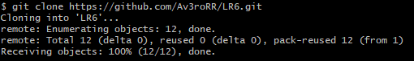
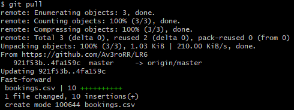
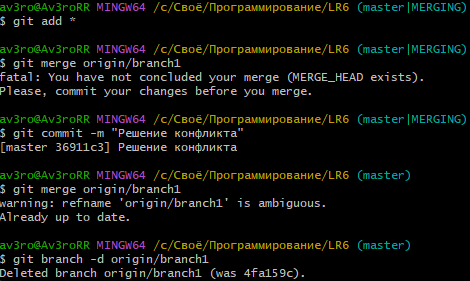
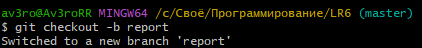

# LR6
Лабораторная работа №6

Порядок выполнения:

Скопировал репозиторий командой `git clone {ссылка на репозиторий}` и перешёл в папку с проектом с помоощью команды `cd LR6`



Далее добавил файл через интерфейс GitHub и подтянул изменения в локальный репозиторй с помощью команды `git pull`



Исправил конфликт внутри файла добавил его с помощью команды `git add *` и сделал коммит, чтобы сделать `git merge origin/branch1` далее удалил ненужную ветку



Добавил пару изменений и сделал commit'ы и откатил один commit.

 

Далее создал ветку для отчёта



# Последовательность действий
1. Клонировал GitHub репозиторий используя
```bash
git clone https://github.com/Av3roRR/LR6.git
```


2. Просмотрел логи всех веток
```bash
git branch
git log branch1
git log master
```


3. Сделал merge ветки branch1
```bash
git merge origin/branch1
```

4. Удалил branch1 с помощью
```bash
git branch -d origin/branch1
```

5. Сделал несколько коммитов, оставиви комментарии
6. Откатился на предпоследний коммит с помощью
```bash
git reset --soft HEAD~1
```

7. Создал новую ветку для отчета и сразу перешёл в неё
```bash
git checkout -b report
```

8. Удалил отчет с мастера и залил в отдельную ветку


9. Понял что намудрил и слил мастер в otchet чтобы перетянуть скрины

## git log

```text
9910c57 2024-11-14 | Добавление скриншотов и изменение md файла (HEAD -> report, origin/report) [4319 Емельянов А.М.]
bd86a9d 2024-11-14 | Добавил комментарии (master) [4319 Емельянов А.М.]
36911c3 2024-11-14 | Решение конфликта [4319 Емельянов А.М.]
4fa159c 2024-11-14 | Add files via upload (origin/master, origin/HEAD) [Andrew]
921f53b 2020-11-21 | Обновление информации [Kurtyanik]
0f9f50d 2020-11-21 | Заполнил файл (origin/branch1) [Kurtyanik]
c08a654 2020-11-21 | Файл создан пустым [Kurtyanik]
3c6e913 2020-11-21 | Initial commit [Kurtyanik]
```